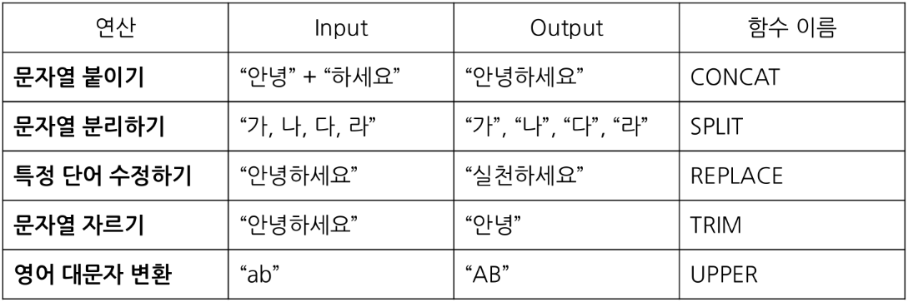
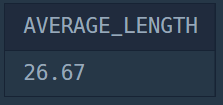

# First Study Week

## Q1. 잡은 물고기 중 가장 큰 물고기의 길이 구하기
> SUM, MIN, MAX   
> 실제 사용: MAX, CONCAT

#### [문제1_링크](https://school.programmers.co.kr/learn/courses/30/lessons/298515)

#### 날짜: 0111

### 문제 설명
낚시앱에서 사용하는 `FISH_INFO` 테이블은 잡은 물고기들의 정보를 담고 있습니다. `FISH_INFO` 테이블의 구조는 다음과 같으며 `ID`, `FISH_TYPE`, `LENGTH`, `TIME`은 각각 잡은 물고기의 ID, 물고기의 종류(숫자), 잡은 물고기의 길이(cm), 물고기를 잡은 날짜를 나타냅니다.

단, 잡은 물고기의 길이가 10cm 이하일 경우에는
LENGTH가 NULL 이며, LENGTH 에 NULL 만 있는 경우는 없습니다.

### 문제
FISH_INFO 테이블에서 잡은 물고기 중 가장 큰 물고기의 길이를 'cm' 를 붙여 출력하는 SQL 문을 작성해주세요.

이 때 컬럼명은 'MAX_LENGTH' 로 지정해주세요.

### 정답 쿼리
```sql
SELECT
    CONCAT(MAX(LENGTH), "cm") AS MAX_LENGTH
FROM FISH_INFO
```

### 문제 풀이 과정

#### 1. 컬럼명을 'MAX_LENGTH' 로 지정하여 가장 큰 물고기의 길이를 출력

```sql
SELECT
    MAX(LENGTH) AS MAX_LENGTH
FROM FISH_INFO
```

#### 2. "cm"를 붙여서 출력

```sql
SELECT
    CONCAT(MAX(LENGTH), "cm") AS MAX_LENGTH
FROM FISH_INFO
```

#### 2-1. 문자열 데이터로 할 수 있는 대표적인 연산



### 출력 결과


## Q2. 잡은 물고기의 평균 길이 구하기
> IS NULL   
> 실제 사용: IFNULL, AVG, ROUND

#### [문제2_링크](https://school.programmers.co.kr/learn/courses/30/lessons/293259)

#### 날짜: 0112

### 문제 설명
낚시앱에서 사용하는 FISH_INFO 테이블은 잡은 물고기들의 정보를 담고 있습니다. FISH_INFO 테이블의 구조는 다음과 같으며 ID, FISH_TYPE, LENGTH, TIME은 각각 잡은 물고기의 ID, 물고기의 종류(숫자), 잡은 물고기의 길이(cm), 물고기를 잡은 날짜를 나타냅니다.

단, 잡은 물고기의 길이가 10cm 이하일 경우에는
LENGTH가 NULL 이며, LENGTH 에 NULL 만 있는 경우는 없습니다.


### 문제
잡은 물고기의 평균 길이를 출력하는 SQL문을 작성해주세요.

평균 길이를 나타내는 컬럼 명은 AVERAGE_LENGTH로 해주세요.
평균 길이는 소수점 3째자리에서 반올림하며, 10cm 이하의 물고기들은 10cm 로 취급하여 평균 길이를 구해주세요.


### 정답 쿼리
```sql
SELECT
    ROUND(AVG(IFNULL(LENGTH, 10)), 2) AS AVERAGE_LENGTH
FROM
    FISH_INFO
```

### 문제 풀이 과정

#### 1. 컬럼명을 'AVERAGE_LENGTH' 로 지정하여 잡은 물고기의 평균 길이를 출력

```sql
SELECT
    AVG(LENGTH) AS AVERAGE_LENGTH
FROM
    FISH_INFO
```

#### 2. LENGTH 열에 NULL 값이 있는 경우 10 으로 취급

```sql
SELECT
    AVG(IFNULL(LENGTH, 10)) AS AVERAGE_LENGTH
FROM
    FISH_INFO
```

#### 3. 소수점 3째자리에서 반올림하여 출력

```sql
SELECT
    ROUND(AVG(IFNULL(LENGTH, 10)), 2) AS AVERAGE_LENGTH
FROM
    FISH_INFO
```

### 출력 결과



## Q3-1. 대여 횟수가 많은 자동차들의 월별 대여 횟수 구하기
> Group By 사용

#### [문제3.1_링크](https://school.programmers.co.kr/learn/courses/30/lessons/151139)

#### 날짜: 0113

### 문제 설명
다음은 어느 자동차 대여 회사의 자동차 대여 기록 정보를 담은 `CAR_RENTAL_COMPANY_RENTAL_HISTORY` 테이블입니다. `CAR_RENTAL_COMPANY_RENTAL_HISTORY` 테이블은 아래와 같은 구조로 되어있으며, `HISTORY_ID`, `CAR_ID`, `START_DATE`, `END_DATE` 는 각각 자동차 대여 기록 ID, 자동차 ID, 대여 시작일, 대여 종료일을 나타냅니다.

|Column name|Type|Nullable|
|-|-|-|
|HISTORY_ID|INTEGER|FALSE|
|CAR_ID|INTEGER|FALSE|
|START_DATE|DATE|FALSE|
|END_DATE|DATE|FALSE|


### 문제
`CAR_RENTAL_COMPANY_RENTAL_HISTORY` 테이블에서 대여 시작일을 기준으로 2022년 8월부터 2022년 10월까지 총 대여 횟수가 5회 이상인 자동차들에 대해서 해당 기간 동안의 월별 자동차 ID 별 총 대여 횟수(컬럼명: RECORDS) 리스트를 출력하는 SQL문을 작성해주세요. 결과는 월을 기준으로 오름차순 정렬하고, 월이 같다면 자동차 ID를 기준으로 내림차순 정렬해주세요. 특정 월의 총 대여 횟수가 0인 경우에는 결과에서 제외해주세요.

### 정답 쿼리
```sql
SELECT
    MONTH(START_DATE) AS MONTH,
    CAR_ID,
    COUNT(*) AS RECORDS
FROM CAR_RENTAL_COMPANY_RENTAL_HISTORY
WHERE
    MONTH(START_DATE) BETWEEN 8 AND 10
    AND CAR_ID IN(
        SELECT CAR_ID
        FROM CAR_RENTAL_COMPANY_RENTAL_HISTORY
        WHERE MONTH(START_DATE) BETWEEN 8 AND 10
        GROUP BY CAR_ID
        HAVING COUNT(*) >= 5)
GROUP BY
    MONTH, CAR_ID
ORDER BY
    MONTH ASC,
    CAR_ID DESC;
```

### 문제 풀이 과정

#### 1. 문제의 조건과 출력 결과를 보고 필요한 함수와 SELECT문 작성

```sql
SELECT
    MONTH,
    CAR_ID,
    RECORDS
FROM CAR_RENTAL_COMPANY_RENTAL_HISTORY
WHERE
GROUP BY
ORDER BY
```

#### 2. GROUP BY, ORDER BY

```sql
SELECT
    MONTH(START_DATE) AS MONTH,
    CAR_ID,
    COUNT(*) AS RECORDS
FROM CAR_RENTAL_COMPANY_RENTAL_HISTORY
WHERE
GROUP BY
    MONTH, CAR_ID
ORDER BY
    MONTH ASC,
    CAR_ID DESC;
```


#### 3. WHERE 절에 조건 추가
: 대여 시작일을 기준으로 8월부터 10월까지 총 대여 횟수가 5회 이상인 자동차들 필터링   
*WITH 문 대신 IN을 사용하여 WHERE 절에 서브쿼리를 작성

```sql
SELECT
    MONTH(START_DATE) AS MONTH,
    CAR_ID,
    COUNT(*) AS RECORDS
FROM CAR_RENTAL_COMPANY_RENTAL_HISTORY
WHERE MONTH(START_DATE) BETWEEN 8 AND 10
    AND CAR_ID IN(
        SELECT CAR_ID
        FROM CAR_RENTAL_COMPANY_RENTAL_HISTORY
        WHERE MONTH(START_DATE) BETWEEN 8 AND 10
        GROUP BY CAR_ID
        HAVING COUNT(*) >=5
    )
GROUP BY
    MONTH, CAR_ID
ORDER BY
    MONTH ASC,
    CAR_ID DESC;
```


## Q3-2. 특정 옵션이 포함된 자동차 리스트 구하기
> String, Date 사용

#### [문제3.2_링크](https://school.programmers.co.kr/learn/courses/30/lessons/157343)

#### 날짜:

### 문제 설명


### 문제
