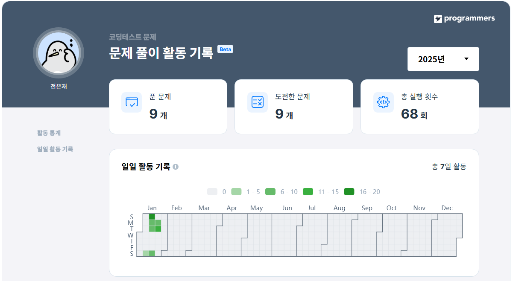

# Second Study Week

## Q1. 과일로 만든 아이스크림 만들기
> SELECT   
> 실제 사용: JOIN

#### [문제1_링크](https://school.programmers.co.kr/learn/courses/30/lessons/133025)

#### 날짜: 0118

### 문제 설명
다음은 아이스크림 가게의 상반기 주문 정보를 담은 FIRST_HALF 테이블과 아이스크림 성분에 대한 정보를 담은 ICECREAM_INFO 테이블입니다.

`FIRST_HALF` 테이블의 속성은 `SHIPMENT_ID`, `FLAVOR`, `TOTAL_ORDER` 이고, 각각 아이스크림 공장에서 아이스크림 가게까지의 출하 번호, 아이스크림 맛, 상반기 아이스크림 총주문량을 나타냅니다. FIRST_HALF 테이블의 기본 키는 FLAVOR입니다.

`ICECREAM_INFO` 테이블 속성은 `FLAVOR`, `INGREDITENT_TYPE` 이고, 각각 아이스크림 맛, 아이스크림의 성분 타입을 나타냅니다. INGREDIENT_TYPE에는 아이스크림의 주 성분이 설탕이면 sugar_based라고 입력되고, 아이스크림의 주 성분이 과일이면 fruit_based라고 입력됩니다. ICECREAM_INFO의 기본 키는 FLAVOR입니다. ICECREAM_INFO테이블의 FLAVOR는 FIRST_HALF 테이블의 FLAVOR의 외래 키입니다.

### 문제
상반기 아이스크림 총주문량이 3,000보다 높으면서 아이스크림의 주 성분이 과일인 아이스크림의 맛을 총주문량이 큰 순서대로 조회하는 SQL 문을 작성해주세요.

### 정답 쿼리
```sql
SELECT
    A.FLAVOR
FROM
    FIRST_HALF AS A
LEFT JOIN ICECREAM_INFO AS B
ON A.FLAVOR = B.FLAVOR
WHERE
    B.INGREDIENT_TYPE = 'fruit_based' AND A.TOTAL_ORDER > 3000
ORDER BY
    A.TOTAL_ORDER DESC;
```

### 문제 풀이 과정

#### 1. `FLAVOR`을 키로 하여 두 테이블을 JOIN 

```sql
SELECT
FROM
    FIRST_HALF AS A
LEFT JOIN ICECREAM_INFO AS B
ON A.FLAVOR = B.FLAVOR
```

#### 1-1. JOIN 쿼리 작성하기
FROM 하단에 JOIN 할 Table을 작성하고   
ON 뒤에 공통된 컬럼(Key)를 작성   


#### 2. 조건 설정: `총주문량`이 3,000 초과, `INGREDITENT_TYPE` 이 fruit_based

```sql
SELECT
FROM FIRST_HALF AS A
LEFT JOIN ICECREAM_INFO AS B
ON A.FLAVOR = B.FLAVOR
WHERE
    A.TOTAL_ORDER > 3000 AND B.INGREDITENT_TYPE = 'fruit_based'
```

#### 3. FLAVOR을 총주문량이 큰 순서대로 정렬

```sql
SELECT
FROM FIRST_HALF AS A
LEFT JOIN ICECREAM_INFO AS B
ON A.FLAVOR = B.FLAVOR
WHERE
    A.TOTAL_ORDER > 3000 AND B.INGREDITENT_TYPE = 'fruit_based'
ORDER BY A.TOTAL_ORDER DESC;
```


## Q2. 자동차 종류 별 특정 옵션이 포함된 자동차 수 구하기
> GROUP BY   
> 실제 사용: COUNT, GROUP BY, LIKE

#### [문제2_링크](https://school.programmers.co.kr/learn/courses/30/lessons/151137)

#### 날짜: 0120

### 문제 설명
다음은 어느 자동차 대여 회사에서 대여중인 자동차들의 정보를 담은 CAR_RENTAL_COMPANY_CAR 테이블입니다. CAR_RENTAL_COMPANY_CAR 테이블은 아래와 같은 구조로 되어있으며, CAR_ID, CAR_TYPE, DAILY_FEE, OPTIONS 는 각각 자동차 ID, 자동차 종류, 일일 대여 요금(원), 자동차 옵션 리스트를 나타냅니다.

자동차 종류는 '세단', 'SUV', '승합차', '트럭', '리무진' 이 있습니다. 자동차 옵션 리스트는 콤마(',')로 구분된 키워드 리스트(옵션 리스트 값 예시: '열선시트', '스마트키', '주차감지센서')로 되어있으며, 키워드 종류는 '주차감지센서', '스마트키', '네비게이션', '통풍시트', '열선시트', '후방카메라', '가죽시트' 가 있습니다.


### 문제
CAR_RENTAL_COMPANY_CAR 테이블에서 '통풍시트', '열선시트', '가죽시트' 중 하나 이상의 옵션이 포함된 자동차가 자동차 종류 별로 몇 대인지 출력하는 SQL문을 작성해주세요. 이때 자동차 수에 대한 컬럼명은 CARS로 지정하고, 결과는 자동차 종류를 기준으로 오름차순 정렬해주세요.


### 정답 쿼리
```sql
SELECT
    CAR_TYPE,
    COUNT(*) AS CARS
FROM CAR_RENTAL_COMPANY_CAR
WHERE
    OPTIONS LIKE '%통풍시트%'
    OR OPTIONS LIKE '%열선시트%'
    OR OPTIONS LIKE '%가죽시트%'
GROUP BY CAR_TYPE
ORDER BY CAR_TYPE ASC;
```

### 문제 풀이 과정

#### 1. SELECT

```sql
SELECT
    CAR_TYPE,
    COUNT(*) AS CARS
FROM CAR_RENTAL_COMPANY_CAR
WHERE
GROUP BY CAR_TYPE
ORDER BY
```

#### 2. 조건(하나 이상 문자열 포함 -> LIKE)

```sql
SELECT
    CAR_TYPE,
    COUNT(*) AS CARS
FROM CAR_RENTAL_COMPANY_CAR
WHERE
    OPTIONS LIKE '%통풍시트%'
    OR OPTIONS LIKE '%열선시트%'
    OR OPTIONS LIKE '%가죽시트%'
GROUP BY CAR_TYPE
ORDER BY
```

#### 3. 자동차 종류 기준 오름차순 정렬

```sql
SELECT
    CAR_TYPE,
    COUNT(*) AS CARS
FROM CAR_RENTAL_COMPANY_CAR
WHERE
    OPTIONS LIKE '%통풍시트%'
    OR OPTIONS LIKE '%열선시트%'
    OR OPTIONS LIKE '%가죽시트%'
GROUP BY CAR_TYPE
ORDER BY
    CAR_TYPE ASC;
```


## Q3. 가장 큰 물고기 10마리 구하기
> SELECT   
> 실제 사용: LIMIT

#### [문제3_링크](https://school.programmers.co.kr/learn/courses/30/lessons/298517)

#### 날짜: 0120

### 문제 설명
낚시앱에서 사용하는 FISH_INFO 테이블은 잡은 물고기들의 정보를 담고 있습니다. FISH_INFO 테이블의 구조는 다음과 같으며 ID, FISH_TYPE, LENGTH, TIME은 각각 잡은 물고기의 ID, 물고기의 종류(숫자), 잡은 물고기의 길이(cm), 물고기를 잡은 날짜를 나타냅니다.

단, 잡은 물고기의 길이가 10cm 이하일 경우에는 LENGTH 가 NULL 이며, LENGTH 에 NULL 만 있는 경우는 없습니다.

### 문제
FISH_INFO 테이블에서 가장 큰 물고기 10마리의 ID와 길이를 출력하는 SQL 문을 작성해주세요. 결과는 길이를 기준으로 내림차순 정렬하고, 길이가 같다면 물고기의 ID에 대해 오름차순 정렬해주세요. 단, 가장 큰 물고기 10마리 중 길이가 10cm 이하인 경우는 없습니다.

ID 컬럼명은 ID, 길이 컬럼명은 LENGTH로 해주세요.

### 정답 쿼리
```sql
SELECT
    ID,
    LENGTH
FROM FISH_INFO
ORDER BY
    LENGTH DESC,
    ID ASC
LIMIT 10;
```

### 문제 풀이 과정

#### 1. 출력문과 문제를 보고 쿼리문을 작성 

```sql
SELECT
    ID,
    LENGTH
FROM FISH_INFO
ORDER BY
    LENGTH DESC,
    ID ASC
```

#### 2. 10개 제한 -> LIMIT

```sql
SELECT
    ID,
    LENGTH
FROM FISH_INFO
ORDER BY
    LENGTH DESC,
    ID ASC
LIMIT 10;
```


## Q4. 조건에 부합하는 중고거래 상태 조회하기
> STRING, DATE   
> 실제 사용: CASE WHEN

#### [문제4_링크](https://school.programmers.co.kr/learn/courses/30/lessons/164672)

#### 날짜: 0121

### 문제 설명
다음은 중고거래 게시판 정보를 담은 USED_GOODS_BOARD 테이블입니다. USED_GOODS_BOARD 테이블은 다음과 같으며 BOARD_ID, WRITER_ID, TITLE, CONTENTS, PRICE, CREATED_DATE, STATUS, VIEWS은 게시글 ID, 작성자 ID, 게시글 제목, 게시글 내용, 가격, 작성일, 거래상태, 조회수를 의미합니다.


### 문제
USED_GOODS_BOARD 테이블에서 2022년 10월 5일에 등록된 중고거래 게시물의 게시글 ID, 작성자 ID, 게시글 제목, 가격, 거래상태를 조회하는 SQL문을 작성해주세요. 거래상태가 SALE 이면 판매중, RESERVED이면 예약중, DONE이면 거래완료 분류하여 출력해주시고, 결과는 게시글 ID를 기준으로 내림차순 정렬해주세요.


### 정답 쿼리
```sql
SELECT
    BOARD_ID,
    WRITER_ID,
    TITLE,
    PRICE,
    CASE
        WHEN STATUS = 'SALE' THEN '판매중'
        WHEN STATUS = 'RESERVED' THEN '예약중'
        ELSE '거래완료'
    END AS STATUS
FROM USED_GOODS_BOARD
WHERE CREATED_DATE = '2022-10-05'
ORDER BY
    BOARD_ID DESC;
```

### 문제 풀이 과정

#### 1. SELECT, 조건

```sql
SELECT
    BOARD_ID,
    WRITER_ID,
    TITLE,
    PRICE,
    AS STATUS
FROM USED_GOODS_BOARD
WHERE CREATED_DATE = '2022-10-05'
ORDER BY
    BOARD_ID DESC;
```

#### 2. STATUS 조건 채우기 -> CASE WHEN

```sql
SELECT
    BOARD_ID,
    WRITER_ID,
    TITLE,
    PRICE,
    CASE
        WHEN STATUS = 'SALE' THEN '판매중'
        WHEN STATUS = 'RESERVED' THEN '예약중'
        ELSE '거래완료'
    END AS STATUS
FROM USED_GOODS_BOARD
WHERE CREATED_DATE = '2022-10-05'
ORDER BY
    BOARD_ID DESC;
```

#### 알쓸신잡

데이터 타입이 VARCHAR(10) 이다.   
= 최대 10개의 문자까지 저장할 수 있다는 의미

## Q5-A. 조건에 맞는 사용자 정보 조회하기
> STRING, DATE   
> 실제 사용: 

#### [문제5.A_링크](https://school.programmers.co.kr/learn/courses/30/lessons/164670)

#### 날짜: 0121

### 문제 설명
다음은 중고 거래 게시판 정보를 담은 USED_GOODS_BOARD 테이블과 중고 거래 게시판 첨부파일 정보를 담은 USED_GOODS_USER 테이블입니다. USED_GOODS_BOARD 테이블은 다음과 같으며 BOARD_ID, WRITER_ID, TITLE, CONTENTS, PRICE, CREATED_DATE, STATUS, VIEWS는 게시글 ID, 작성자 ID, 게시글 제목, 게시글 내용, 가격, 작성일, 거래상태, 조회수를 의미합니다.

USED_GOODS_USER 테이블은 다음과 같으며 USER_ID, NICKNAME, CITY, STREET_ADDRESS1, STREET_ADDRESS2, TLNO는 각각 회원 ID, 닉네임, 시, 도로명 주소, 상세 주소, 전화번호를 의미합니다.


### 문제
USED_GOODS_BOARD와 USED_GOODS_USER 테이블에서 중고 거래 게시물을 3건 이상 등록한 사용자의 사용자 ID, 닉네임, 전체주소, 전화번호를 조회하는 SQL문을 작성해주세요. 이때, 전체 주소는 시, 도로명 주소, 상세 주소가 함께 출력되도록 해주시고, 전화번호의 경우 xxx-xxxx-xxxx 같은 형태로 하이픈 문자열(-)을 삽입하여 출력해주세요. 결과는 회원 ID를 기준으로 내림차순 정렬해주세요.

### 정답 쿼리
```sql

```

### 문제 풀이 과정

#### 1. 문제의 조건과 출력 결과를 보고 필요한 함수와 SELECT문 작성

```sql

```

#### 2. GROUP BY, ORDER BY

```sql

```


#### 3. WHERE 절에 조건 추가
: 대여 시작일을 기준으로 8월부터 10월까지 총 대여 횟수가 5회 이상인 자동차들 필터링   
*WITH 문 대신 IN을 사용하여 WHERE 절에 서브쿼리를 작성

```sql

```


## Q5-B. 조건에 맞는 사용자와 총 거래금액 조회하기
> GROUP BY   
> 실제 사용: SUM, LEFT JOIN, GROUP BY, HAVING

#### [문제5.B_링크](https://school.programmers.co.kr/learn/courses/30/lessons/164668)

#### 날짜: 0121

### 문제 설명
다음은 중고 거래 게시판 정보를 담은 USED_GOODS_BOARD 테이블과 중고 거래 게시판 첨부파일 정보를 담은 USED_GOODS_USER 테이블입니다. USED_GOODS_BOARD 테이블은 다음과 같으며 BOARD_ID, WRITER_ID, TITLE, CONTENTS, PRICE, CREATED_DATE, STATUS, VIEWS는 게시글 ID, 작성자 ID, 게시글 제목, 게시글 내용, 가격, 작성일, 거래상태, 조회수를 의미합니다.

USED_GOODS_USER 테이블은 다음과 같으며 USER_ID, NICKNAME, CITY, STREET_ADDRESS1, STREET_ADDRESS2, TLNO는 각각 회원 ID, 닉네임, 시, 도로명 주소, 상세 주소, 전화번호를 의미합니다.


### 문제
USED_GOODS_BOARD와 USED_GOODS_USER 테이블에서 완료된 중고 거래의 총금액이 70만 원 이상인 사람의 회원 ID, 닉네임, 총거래금액을 조회하는 SQL문을 작성해주세요. 결과는 총거래금액을 기준으로 오름차순 정렬해주세요.

### 정답 쿼리
```sql
SELECT
    B.USER_ID,
    B.NICKNAME,
    SUM(A.PRICE) AS TOTAL_SALES
FROM USED_GOODS_USER AS B
LEFT JOIN USED_GOODS_BOARD AS A
ON A.WRITER_ID = B.USER_ID
WHERE
    A.STATUS = 'DONE'
GROUP BY B.USER_ID, B.NICKNAME
HAVING TOTAL_SALES >= 700000
ORDER BY
    TOTAL_SALES ASC;
```

### 문제 풀이 과정

#### 1. 문제의 조건과 출력 결과를 보고 필요한 함수와 SELECT문 작성
```sql
SELECT
    B.USER_ID,
    B.NICKNAME,
    AS TOTAL_SALES
FROM USED_GOODS_USER AS B
LEFT JOIN USED_GOODS_BOARD AS A
ON A.WRITER_ID = B.USER_ID
WHERE
    A.STATUS = 'DONE'
HAVING TOTAL_SALES >= 700000
ORDER BY
    TOTAL_SALES ASC;
```

#### 1-1. WHERE과 HAVING

`WHERE`는 원본 데이터 필터링에 사용   
`HAVING`은 그룹화된 결과에 조건을 적용   
=> `GROUP BY`로 조건을 설정하는 경우 WHERE과 HAVING 사이에 들어간다. 따라서 필터링이냐 결과에 조건을 덧붙이는 것이냐에 따라 WHERE을 사용할지 HAVING을 사용할지 결정할 수 있다.

#### 2. TOTAL_SALES 정의하기

```sql
SELECT
    B.USER_ID,
    B.NICKNAME,
    SUM(A.PRICE) AS TOTAL_SALES
FROM USED_GOODS_USER AS B
LEFT JOIN USED_GOODS_BOARD AS A
ON A.WRITER_ID = B.USER_ID
WHERE
    A.STATUS = 'DONE'
GROUP BY B.USER_ID, B.NICKNAME
HAVING TOTAL_SALES >= 700000
ORDER BY
    TOTAL_SALES ASC;
```


## 활동 인증
