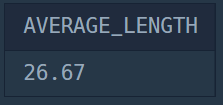

# Second Study Week

## Q1. 과일로 만든 아이스크림 만들기
> SELECT   
> 실제 사용: JOIN

#### [문제1_링크](https://school.programmers.co.kr/learn/courses/30/lessons/133025)

#### 날짜: 0118

### 문제 설명
다음은 아이스크림 가게의 상반기 주문 정보를 담은 FIRST_HALF 테이블과 아이스크림 성분에 대한 정보를 담은 ICECREAM_INFO 테이블입니다.

`FIRST_HALF` 테이블의 속성은 `SHIPMENT_ID`, `FLAVOR`, `TOTAL_ORDER` 이고, 각각 아이스크림 공장에서 아이스크림 가게까지의 출하 번호, 아이스크림 맛, 상반기 아이스크림 총주문량을 나타냅니다. FIRST_HALF 테이블의 기본 키는 FLAVOR입니다.

`ICECREAM_INFO` 테이블 속성은 `FLAVOR`, `INGREDITENT_TYPE` 이고, 각각 아이스크림 맛, 아이스크림의 성분 타입을 나타냅니다. INGREDIENT_TYPE에는 아이스크림의 주 성분이 설탕이면 sugar_based라고 입력되고, 아이스크림의 주 성분이 과일이면 fruit_based라고 입력됩니다. ICECREAM_INFO의 기본 키는 FLAVOR입니다. ICECREAM_INFO테이블의 FLAVOR는 FIRST_HALF 테이블의 FLAVOR의 외래 키입니다.

### 문제
상반기 아이스크림 총주문량이 3,000보다 높으면서 아이스크림의 주 성분이 과일인 아이스크림의 맛을 총주문량이 큰 순서대로 조회하는 SQL 문을 작성해주세요.

### 정답 쿼리
```sql
SELECT
    A.FLAVOR
FROM
    FIRST_HALF AS A
LEFT JOIN ICECREAM_INFO AS B
ON A.FLAVOR = B.FLAVOR
WHERE
    B.INGREDIENT_TYPE = 'fruit_based' AND A.TOTAL_ORDER > 3000
ORDER BY
    A.TOTAL_ORDER DESC;
```

### 문제 풀이 과정

#### 1. `FLAVOR`을 키로 하여 두 테이블을 JOIN 

```sql
SELECT
FROM
    FIRST_HALF AS A
LEFT JOIN ICECREAM_INFO AS B
ON A.FLAVOR = B.FLAVOR
```

#### 1-1. JOIN 쿼리 작성하기
FROM 하단에 JOIN 할 Table을 작성하고   
ON 뒤에 공통된 컬럼(Key)를 작성   


#### 2. 조건 설정: `총주문량`이 3,000 초과, `INGREDITENT_TYPE` 이 fruit_based

```sql
SELECT
FROM FIRST_HALF AS A
LEFT JOIN ICECREAM_INFO AS B
ON A.FLAVOR = B.FLAVOR
WHERE
    A.TOTAL_ORDER > 3000 AND B.INGREDITENT_TYPE = 'fruit_based'
```

#### 3. FLAVOR을 총주문량이 큰 순서대로 정렬

```sql
SELECT
FROM FIRST_HALF AS A
LEFT JOIN ICECREAM_INFO AS B
ON A.FLAVOR = B.FLAVOR
WHERE
    A.TOTAL_ORDER > 3000 AND B.INGREDITENT_TYPE = 'fruit_based'
ORDER BY A.TOTAL_ORDER DESC;
```


## Q2. 자동차 종류 별 특정 옵션이 포함된 자동차 수 구하기
> GROUP BY   
> 실제 사용: IFNULL, AVG, ROUND

#### [문제2_링크](https://school.programmers.co.kr/learn/courses/30/lessons/151137)

#### 날짜: 0118

### 문제 설명
다음은 어느 자동차 대여 회사에서 대여중인 자동차들의 정보를 담은 CAR_RENTAL_COMPANY_CAR 테이블입니다. CAR_RENTAL_COMPANY_CAR 테이블은 아래와 같은 구조로 되어있으며, CAR_ID, CAR_TYPE, DAILY_FEE, OPTIONS 는 각각 자동차 ID, 자동차 종류, 일일 대여 요금(원), 자동차 옵션 리스트를 나타냅니다.

자동차 종류는 '세단', 'SUV', '승합차', '트럭', '리무진' 이 있습니다. 자동차 옵션 리스트는 콤마(',')로 구분된 키워드 리스트(옵션 리스트 값 예시: '열선시트', '스마트키', '주차감지센서')로 되어있으며, 키워드 종류는 '주차감지센서', '스마트키', '네비게이션', '통풍시트', '열선시트', '후방카메라', '가죽시트' 가 있습니다.


### 문제
CAR_RENTAL_COMPANY_CAR 테이블에서 '통풍시트', '열선시트', '가죽시트' 중 하나 이상의 옵션이 포함된 자동차가 자동차 종류 별로 몇 대인지 출력하는 SQL문을 작성해주세요. 이때 자동차 수에 대한 컬럼명은 CARS로 지정하고, 결과는 자동차 종류를 기준으로 오름차순 정렬해주세요.


### 정답 쿼리
```sql
SELECT
    ROUND(AVG(IFNULL(LENGTH, 10)), 2) AS AVERAGE_LENGTH
FROM
    FISH_INFO
```

### 문제 풀이 과정

#### 1. 컬럼명을 'AVERAGE_LENGTH' 로 지정하여 잡은 물고기의 평균 길이를 출력

```sql
SELECT
    AVG(LENGTH) AS AVERAGE_LENGTH
FROM
    FISH_INFO
```

#### 2. LENGTH 열에 NULL 값이 있는 경우 10 으로 취급

```sql
SELECT
    AVG(IFNULL(LENGTH, 10)) AS AVERAGE_LENGTH
FROM
    FISH_INFO
```

#### 3. 소수점 3째자리에서 반올림하여 출력

```sql
SELECT
    ROUND(AVG(IFNULL(LENGTH, 10)), 2) AS AVERAGE_LENGTH
FROM
    FISH_INFO
```

### 출력 결과



## Q3-1. 대여 횟수가 많은 자동차들의 월별 대여 횟수 구하기
> Group By   
> 실제 사용: GROUP BY, ORDER BY, HAVING 등

#### [문제3.1_링크](https://school.programmers.co.kr/learn/courses/30/lessons/151139)

#### 날짜: 0113

### 문제 설명
다음은 어느 자동차 대여 회사의 자동차 대여 기록 정보를 담은 `CAR_RENTAL_COMPANY_RENTAL_HISTORY` 테이블입니다. `CAR_RENTAL_COMPANY_RENTAL_HISTORY` 테이블은 아래와 같은 구조로 되어있으며, `HISTORY_ID`, `CAR_ID`, `START_DATE`, `END_DATE` 는 각각 자동차 대여 기록 ID, 자동차 ID, 대여 시작일, 대여 종료일을 나타냅니다.

|Column name|Type|Nullable|
|-|-|-|
|HISTORY_ID|INTEGER|FALSE|
|CAR_ID|INTEGER|FALSE|
|START_DATE|DATE|FALSE|
|END_DATE|DATE|FALSE|


### 문제
`CAR_RENTAL_COMPANY_RENTAL_HISTORY` 테이블에서 대여 시작일을 기준으로 2022년 8월부터 2022년 10월까지 총 대여 횟수가 5회 이상인 자동차들에 대해서 해당 기간 동안의 월별 자동차 ID 별 총 대여 횟수(컬럼명: RECORDS) 리스트를 출력하는 SQL문을 작성해주세요. 결과는 월을 기준으로 오름차순 정렬하고, 월이 같다면 자동차 ID를 기준으로 내림차순 정렬해주세요. 특정 월의 총 대여 횟수가 0인 경우에는 결과에서 제외해주세요.

### 정답 쿼리
```sql
SELECT
    MONTH(START_DATE) AS MONTH,
    CAR_ID,
    COUNT(*) AS RECORDS
FROM CAR_RENTAL_COMPANY_RENTAL_HISTORY
WHERE
    MONTH(START_DATE) BETWEEN 8 AND 10
    AND CAR_ID IN(
        SELECT CAR_ID
        FROM CAR_RENTAL_COMPANY_RENTAL_HISTORY
        WHERE MONTH(START_DATE) BETWEEN 8 AND 10
        GROUP BY CAR_ID
        HAVING COUNT(*) >= 5)
GROUP BY
    MONTH, CAR_ID
ORDER BY
    MONTH ASC,
    CAR_ID DESC;
```

### 문제 풀이 과정

#### 1. 문제의 조건과 출력 결과를 보고 필요한 함수와 SELECT문 작성

```sql
SELECT
    MONTH,
    CAR_ID,
    RECORDS
FROM CAR_RENTAL_COMPANY_RENTAL_HISTORY
WHERE
GROUP BY
ORDER BY
```

#### 2. GROUP BY, ORDER BY

```sql
SELECT
    MONTH(START_DATE) AS MONTH,
    CAR_ID,
    COUNT(*) AS RECORDS
FROM CAR_RENTAL_COMPANY_RENTAL_HISTORY
WHERE
GROUP BY
    MONTH, CAR_ID
ORDER BY
    MONTH ASC,
    CAR_ID DESC;
```


#### 3. WHERE 절에 조건 추가
: 대여 시작일을 기준으로 8월부터 10월까지 총 대여 횟수가 5회 이상인 자동차들 필터링   
*WITH 문 대신 IN을 사용하여 WHERE 절에 서브쿼리를 작성

```sql
SELECT
    MONTH(START_DATE) AS MONTH,
    CAR_ID,
    COUNT(*) AS RECORDS
FROM CAR_RENTAL_COMPANY_RENTAL_HISTORY
WHERE MONTH(START_DATE) BETWEEN 8 AND 10
    AND CAR_ID IN(
        SELECT CAR_ID
        FROM CAR_RENTAL_COMPANY_RENTAL_HISTORY
        WHERE MONTH(START_DATE) BETWEEN 8 AND 10
        GROUP BY CAR_ID
        HAVING COUNT(*) >=5
    )
GROUP BY
    MONTH, CAR_ID
ORDER BY
    MONTH ASC,
    CAR_ID DESC;
```


## Q3-2. 특정 옵션이 포함된 자동차 리스트 구하기
> String, Date 사용

#### [문제3.2_링크](https://school.programmers.co.kr/learn/courses/30/lessons/157343)

#### 날짜: 0114

### 문제 설명
다음은 어느 자동차 대여 회사에서 대여중인 자동차들의 정보를 담은 CAR_RENTAL_COMPANY_CAR 테이블입니다. CAR_RENTAL_COMPANY_CAR 테이블은 아래와 같은 구조로 되어있으며, CAR_ID, CAR_TYPE, DAILY_FEE, OPTIONS 는 각각 자동차 ID, 자동차 종류, 일일 대여 요금(원), 자동차 옵션 리스트를 나타냅니다.

자동차 종류는 '세단', 'SUV', '승합차', '트럭', '리무진' 이 있습니다. 자동차 옵션 리스트는 콤마(',')로 구분된 키워드 리스트(옵션 리스트 값 예시: '열선시트', '스마트키', '주차감지센서')로 되어있으며, 키워드 종류는 '주차감지센서', '스마트키', '네비게이션', '통풍시트', '열선시트', '후방카메라', '가죽시트' 가 있습니다.


### 문제
`CAR_RENTAL_COMPANY_CAR` 테이블에서 '네비게이션' 옵션이 포함된 자동차 리스트를 출력하는 SQL문을 작성해주세요. 결과는 자동차 ID를 기준으로 내림차순 정렬해주세요.

### 정답 쿼리
```sql
SELECT
    *
FROM
    CAR_RENTAL_COMPANY_CAR
WHERE OPTIONS LIKE '%네비게이션%'
ORDER BY
    CAR_ID DESC;
```

### 문제 풀이 과정

#### 1. 문제의 조건과 출력 결과를 보고 필요한 함수와 SELECT문 작성
```sql
SELECT
    *
FROM
    CAR_RENTAL_COMPANY_CAR
WHERE
ORDER BY
    CAR_ID DESC;
```

#### 2. WHERE 조건 채우기
```sql
SELECT
    *
FROM
    CAR_RENTAL_COMPANY_CAR
WHERE OPTIONS LIKE '%네비게이션%'
ORDER BY
    CAR_ID DESC;
```

#### 2-1. LIKE 연산자

`LIKE` 연산자는 SQL에서 문자열 패턴 매칭을 수행하는 데 사용됩니다. 주로 WHERE 절과 함께 사용되며, 특정 패턴과 일치하는 문자열을 검색하는 데 유용합니다.

|조건|SQL 예제|설명|
|---|--------|---|
|특정 문자열 포함|LIKE '%text%'|text가 포함된 모든 문자열 검색|
|특정 문자로 시작|LIKE 'text%'|text로 시작하는 모든 문자열 검색|
|특정 문자로 끝남|LIKE '%text'|text로 끝나는 모든 문자열 검색|


## 활동 인증
